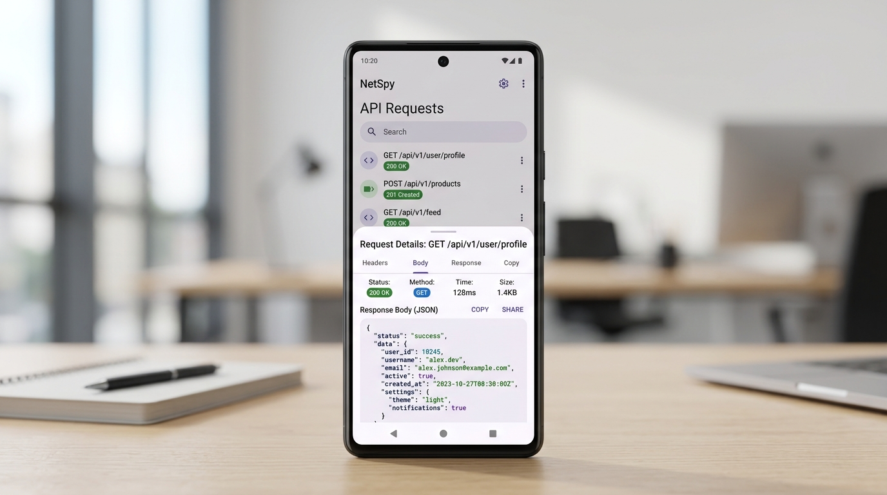

# Network Inspector for Android

A lightweight, production-grade **Network & API Inspector** bottom-sheet UI for Android applications, built with modern **MVVM architecture**, **XML layouts**, **ViewBinding**, and **Material Components (M3)**.



---

## 🌟 Overview

Network Inspector provides an in-app debugging and traffic-monitoring overlay inspired by professional developer tools. It operates entirely as clean, nested **Bottom Sheet Dialog Fragments** on top of your application screens, allowing you or your QA team to inspect endpoints, headers, payloads, timings, and error states without leaving the app.

The architecture strictly decouples the UI from the network layer. You can start with realistic sample requests and swap in your live Retrofit API service or HTTP client with just a few lines of code.

---

## 📱 UI Screens & Working Explanation

```
┌────────────────────────────────────────────────────────────────────────┐
│                        MAIN HOST SCREEN                                │
│   [Traffic Monitor Card] • [Requests: 18] • [Success: 83%] • [174ms]   │
│   [ Open Network Inspector Button ]                                    │
└────────────────────────────────────┬───────────────────────────────────┘
                                     │ (Taps button or FAB)
                                     ▼
┌────────────────────────────────────────────────────────────────────────┐
│                   1. API LIST BOTTOM SHEET                             │
│   [Network Inspector] [Search] [Filter] [Clear] [Close]                │
│   ● Live Capture Active  •  Recording HTTP traffic (18 logged)         │
│  ────────────────────────────────────────────────────────────────────  │
│   POST   /post                       200 OK                   142 ms   │
│          api.example.com                                               │
│  ────────────────────────────────────────────────────────────────────  │
│   POST   /login                      401 Unauthorized         210 ms   │
│          auth.example.com  (Highlighted Red for Error)                 │
└───────────────────────────┬────────────────────────────────┬───────────┘
                            │                                │
            (Tap Filter)    │                (Tap on Request)│
                            ▼                                ▼
┌──────────────────────────────────────┐  ┌──────────────────────────────┐
│       2. FILTER BOTTOM SHEET         │  │ 3. API DETAIL BOTTOM SHEET   │
│  HTTP METHOD                         │  │ POST  /post  200 OK  [Close] │
│  [GET] [POST] [PUT] [PATCH] [DELETE] │  │ [REQUEST] [RESPONSE] [DETAIL]│
│                                      │  │ ──────────────────────────── │
│  STATUS CODE                         │  │ • Request Tab:               │
│  [Success 2xx] [Redirect 3xx]        │  │   - URL & Method (Copyable)  │
│  [Client Error 4xx] [Server Error]   │  │   - Headers list (Copyable)  │
│                                      │  │   - Dark JSON Code Block     │
│  OPTIONS                             │  │ • Response Tab:              │
│  HTTPS only [Toggle]                 │  │   - Status code & latency    │
│  Errors only [Toggle]                │  │   - Response headers (Copy)  │
│                                      │  │   - Formatted JSON response  │
│  [Clear Filters]      [Apply]        │  │ • Details Tab:               │
│                                      │  │   - General, Timing, Network │
│                                      │  │   - Request & Response sizes │
└──────────────────────────────────────┘  └──────────────────────────────┘
```

### 1. API List Screen (`ApiListBottomSheet`)
- **Header Toolbar**: Shows the current captured request count (`"18 Requests"`), search toggle, filter trigger with badge indicator, clear history button, and sheet close icon.
- **Live Status Row**: Pulsing green activity indicator notifying whether capture is recording and how many requests are logged.
- **Request Rows**:
  - Color-coded HTTP method badge (`POST` green, `GET` blue, `DELETE` red, `PUT` amber, `PATCH` purple).
  - Path and Host domain.
  - HTTP Status Code badge (`200 OK`, `201 Created`, `204 No Content`, `302 Found`, `401 Unauthorized`, `500 Server Error`).
  - Request duration (`ms`) and formatted timestamp (`HH:mm:ss`).
  - **Error Highlighting**: Failed requests (4xx / 5xx) automatically style with subtle red card strokes and backgrounds for instant visual scanning.

### 2. Search & Filtering
- **Interactive Search**: Real-time filtering by URL, host domain, HTTP method, or status code with instant match count.
- **Filter Sheet (`ApiFilterBottomSheet`)**:
  - Multi-select chips for HTTP Methods.
  - Multi-select chips for Status categories.
  - Toggles for `HTTPS only` and `Requests with errors only`.
  - Dispatches an immutable `ApiFilter` data class to `ApiViewModel`.

### 3. API Detail Screen (`ApiDetailBottomSheet`)
Uses `TabLayout` + `ViewPager2` across three dedicated tabs:
- **`REQUEST`**:
  - **General Section**: Full URL and HTTP Method with a 1-tap Copy action.
  - **Headers Section**: Header count badge, expandable key/value rows, and copy all headers button.
  - **Request Body**: Formatted, 2-space indented JSON displayed in a high-contrast dark code block with copy action.
- **`RESPONSE`**:
  - Full status response code, status message, and round-trip duration badge.
  - Response headers (expandable with key/value styling).
  - Response payload formatted in a dark code block with body size indicator.
- **`DETAILS`**:
  - **General**: URL, Method, Protocol (`HTTP/2`), Host, Status.
  - **Timing**: Request start timestamp (`yyyy-MM-dd HH:mm:ss.SSS`), request duration, connection duration, and response duration.
  - **Network**: Remote IP address and port, request size, and response size.
  - **Request & Response Metrics**: Payload byte counts, headers count, and `Content-Type`.

### 4. Empty, Loading, and Error States
- **Skeleton Shimmer**: Animated placeholder rows appear while asynchronous network calls are loading.
- **Empty State**: Custom flat illustration, clean messaging, and an interactive button to reload sample data.
- **Clear History Confirmation**: Built-in Material 3 alert dialog preventing accidental loss of captured request logs.

---

## 🏗️ Architecture & Project Structure

The project follows standard **Clean MVVM** principles:

```
app/src/main/
├── java/com/example/
│   ├── MainActivity.kt                      // Host application screen
│   ├── model/
│   │   ├── ApiRequest.kt                    // Domain model for UI rendering
│   │   ├── ApiFilter.kt                     // Filter criteria data class
│   │   ├── HttpMethod.kt                    // HTTP Method enum (GET, POST, etc.)
│   │   └── StatusCategory.kt                // Status category enum (Success, Error, etc.)
│   ├── network/
│   │   ├── ApiService.kt                    // [// MY API] Retrofit interface placeholder
│   │   └── ApiDto.kt                        // [// API RESPONSE -> UI MODEL MAPPING] DTOs & toDomain()
│   ├── repository/
│   │   ├── ApiRepository.kt                 // Repository interface
│   │   └── FakeApiRepository.kt             // 18 realistic sample API requests
│   ├── ui/api/
│   │   ├── ApiListBottomSheet.kt            // Main inspector list bottom sheet
│   │   ├── ApiDetailBottomSheet.kt          // Expandable 3-tab detail bottom sheet
│   │   ├── ApiFilterBottomSheet.kt          // Method & status filter sheet
│   │   ├── ApiListAdapter.kt                // RecyclerView ListAdapter + DiffUtil
│   │   ├── ApiDetailPagerAdapter.kt         // ViewPager2 adapter
│   │   ├── ApiDetailRequestFragment.kt      // Request tab implementation
│   │   ├── ApiDetailResponseFragment.kt     // Response tab implementation
│   │   └── ApiDetailOverviewFragment.kt     // Timing, Network & Metrics tab
│   ├── utils/
│   │   ├── JsonFormatter.kt                 // Pretty-prints formatted JSON strings
│   │   └── ApiExtensions.kt                 // Formatting dates, sizes, badges
│   └── viewmodel/
│       └── ApiViewModel.kt                  // StateFlow UI state, search, & filter logic
└── res/layout/
    ├── activity_main.xml                    // Host Activity with live monitor stats
    ├── bottom_sheet_api_list.xml            // Inspector Bottom Sheet layout
    ├── bottom_sheet_api_detail.xml          // Detail Bottom Sheet layout
    ├── bottom_sheet_api_filter.xml          // Filter Bottom Sheet layout
    ├── page_api_detail_request.xml          // Request tab layout
    ├── page_api_detail_response.xml         // Response tab layout
    ├── page_api_detail_details.xml          // Details tab layout
    ├── item_api_request.xml                 // Request item card layout
    ├── item_loading.xml                     // Skeleton loading layout
    ├── item_empty.xml                       // Empty state layout
    ├── item_key_value.xml                   // Key-value row layout
    └── item_header.xml                      // Monospace header row layout
```

---

## 🔌 Connecting Your Real API (Step-by-Step)

The project is structured so you can plug in your own Retrofit backend without altering any UI layouts or bottom sheets.

### Step 1: Define Your Endpoints (`// MY API`)
Open `app/src/main/java/com/example/network/ApiService.kt` and declare your Retrofit endpoints:

```kotlin
interface ApiService {
    @GET("requests")
    suspend fun getRequests(@Query("limit") limit: Int = 50): List<ApiRequestDto>

    @GET("users/profile")
    suspend fun getUserProfile(): UserProfileDto
}
```

### Step 2: Map Your API Responses to the UI Model (`// API RESPONSE -> UI MODEL MAPPING`)
Open `app/src/main/java/com/example/network/ApiDto.kt`. Update the `toDomain()` mapping function to convert your server's JSON model into `ApiRequest`:

```kotlin
fun ApiRequestDto.toDomain(): ApiRequest {
    return ApiRequest(
        id = id ?: UUID.randomUUID().toString(),
        method = HttpMethod.valueOf(method ?: "GET"),
        url = url ?: "https://api.yourcompany.com",
        host = host ?: "api.yourcompany.com",
        path = endpoint ?: "/",
        statusCode = status ?: 200,
        statusMessage = message ?: "OK",
        timestamp = timestamp ?: System.currentTimeMillis(),
        durationMs = duration ?: 0L,
        requestHeaders = requestHeaders ?: emptyMap(),
        requestBody = requestBody,
        responseHeaders = responseHeaders ?: emptyMap(),
        responseBody = responseBody,
        requestSize = requestSize ?: 0L,
        responseSize = responseSize ?: 0L
    )
}
```

### Step 3: Switch the Repository Implementation
Create your `RealApiRepository`:

```kotlin
class RealApiRepository(private val apiService: ApiService) : ApiRepository {
    override suspend fun getRequests(): List<ApiRequest> {
        return apiService.getRequests().map { it.toDomain() }
    }

    override suspend fun clearHistory() {
        // Clear cached requests
    }
}
```

Set it globally before opening the inspector (e.g. in your `Application` class or `MainActivity`):

```kotlin
ApiRepositoryProvider.repository = RealApiRepository(myRetrofitApiService)
```

The inspector UI will automatically use your live network repository.

---

## 🛠️ Tech Stack & Dependencies

- **Language**: Kotlin 2.1
- **UI Framework**: XML Layouts + ViewBinding + Material Components 3 (M3)
- **Architecture**: Model-View-ViewModel (MVVM) + Repository Pattern
- **Reactive Streams**: Kotlin Coroutines & `StateFlow` + `repeatOnLifecycle`
- **Lists**: `RecyclerView` + `ListAdapter` + `DiffUtil`
- **Navigation**: Modal `BottomSheetDialogFragment` + `ViewPager2` + `TabLayout`
- **Testing**: JUnit 4 + Robolectric unit testing suite

---

## 🚀 How to Build and Run

1. Clone or download the repository:
   ```bash
   git clone https://github.com/your-username/network-inspector-android.git
   cd network-inspector-android
   ```
2. Open the project in **Android Studio Hedgehog / Jellyfish / Ladybug or newer**.
3. Let Gradle sync project dependencies.
4. Run the app on an Android device or emulator running **API 24 (Android 7.0)+**:
   ```bash
   ./gradlew assembleDebug
   ```
5. Run the Robolectric unit test suite:
   ```bash
   ./gradlew :app:testDebugUnitTest
   ```
